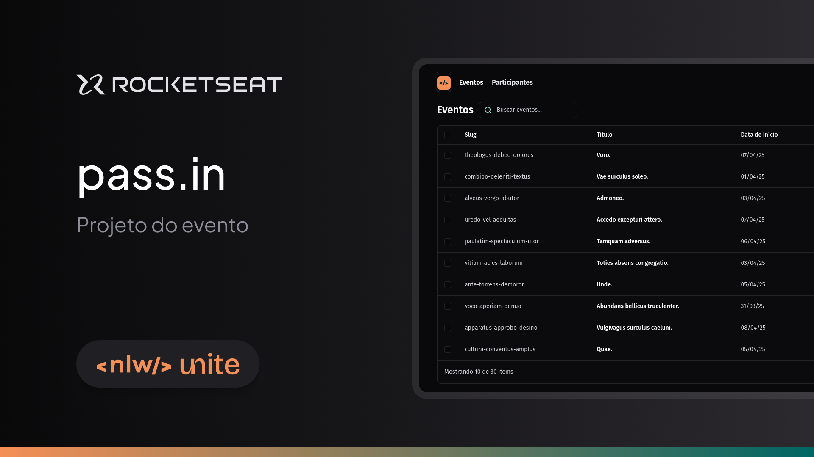

  
O **pass.in** é uma aplicação de **gestão de participantes e eventos**. 

## Tecnologias

- [React](https://react.dev)
- [TypeScript](https://www.typescriptlang.org)
- [Tailwind CSS](https://tailwindcss.com)

## Páginas

  ### Eventos
  
  
  ### Participantes
  

  ### Evento
  
  
  ### Participante
  
